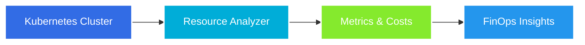
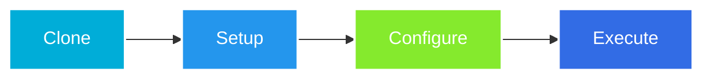

# 🚀 K8s Resource Analyzer API

[🇧🇷 Portuguese Version](README.md)

> HTTP API in Go for Kubernetes resource analysis with FinOps focus.

<div align="center">


[](https://github.com/ElizCarvalho/k8s-resource-analyzer-api/actions/workflows/ci.yml)
[](https://github.com/ElizCarvalho/k8s-resource-analyzer-api/actions/workflows/release.yml)

<p align="center">
  <a href="#-about">About</a> •
  <a href="#-project-status">Status</a> •
  <a href="#-features">Features</a> •
  <a href="#-technologies">Technologies</a> •
  <a href="#-quick-start">Quick Start</a> •
  <a href="#-api-endpoints">API</a>
</p>

</div>

<hr>

## 📌 About

<div align="center">



</div>

K8s Resource Analyzer is a Go API designed to analyze Kubernetes resources with a FinOps focus. The tool provides valuable insights into resource utilization and costs in Kubernetes clusters.

## ⚡ Project Status

| Status | Feature | Description |
|--------|---------|-------------|
| ✅ | **Initial Setup** | Base project structure implemented |
| ✅ | **Health Check** | API health check endpoint |
| ✅ | **Documentation** | OpenAPI/Swagger implemented |
| 🚧 | **Resource Analysis** | K8s resource collection and analysis |
| 🚧 | **Metrics Integration** | Prometheus/Mimir connection |
| 🚧 | **Dashboard** | Metrics and costs visualization |

## 🛠️ Technology Stack

<table>
  <tr>
    <td align="center">
      <b>Core & API</b><br/>
      <br/>
      <a href="https://go.dev/"><b>Go 1.22+ & Gin</b></a>
      <p align="center">
        • Native client-go integration<br/>
        • High performance and low allocation<br/>
        • Robust and flexible middleware<br/>
        • Concurrent execution
      </p>
      <p align="center">
        <code>High-performance web framework</code>
      </p>
    </td>
    <td align="center">
      <b>Observability</b><br/>
      <br/>
      <a href="https://grafana.com/oss/mimir/"><b>Mimir & Zerolog</b></a>
      <p align="center">
        • K8s historical metrics<br/>
        • Structured JSON logging<br/>
        • Request ID tracking<br/>
        • Zero allocation logging
      </p>
      <p align="center">
        <code>Complete and efficient monitoring</code>
      </p>
    </td>
    <td align="center">
      <b>Quality</b><br/>
      <br/>
      <a href="https://golangci-lint.run/"><b>Tools & Standards</b></a>
      <p align="center">
        • Linting (golangci-lint)<br/>
        • Formatting (goimports)<br/>
        • Security (nancy)<br/>
        • Automation (Make)
      </p>
      <p align="center">
        <code>Code quality assurance</code>
      </p>
    </td>
  </tr>
  <tr>
    <td align="center">
      <b>Infrastructure</b><br/>
      <br/>
      <a href="https://www.docker.com/"><b>Container & CI/CD</b></a>
      <p align="center">
        • Docker multi-stage build<br/>
        • GitHub Actions Workflows<br/>
        • Automated deployment<br/>
        • Secure isolation
      </p>
      <p align="center">
        <code>Consistent pipeline and deployment</code>
      </p>
    </td>
    <td align="center">
      <b>Documentation</b><br/>
      <br/>
      <a href="https://swagger.io/"><b>OpenAPI/Swagger</b></a>
      <p align="center">
        • Interactive documentation<br/>
        • Well-defined schemas<br/>
        • Practical examples<br/>
        • Detailed ADRs
      </p>
      <p align="center">
        <code>Clear and up-to-date documentation</code>
      </p>
    </td>
    <td align="center">
      <b>Environment</b><br/>
      <br/>
      <a href="https://kubernetes.io/"><b>Kubernetes & Cloud</b></a>
      <p align="center">
        • K8s resource analysis<br/>
        • Cost metrics<br/>
        • FinOps insights<br/>
        • Resource optimization
      </p>
      <p align="center">
        <code>Focus on efficiency and costs</code>
      </p>
    </td>
  </tr>
</table>

> **Note**: Each technology was chosen considering the specific needs of Kubernetes resource analysis and FinOps, prioritizing performance, observability, and maintainability.

## 📦 Project Structure

```
k8s-resource-analyzer-api/
├── cmd/                    # Application binaries
│   └── api/               # HTTP API entry point
├── internal/              # Private non-exportable code
│   ├── api/              # API endpoints implementation
│   └── pkg/              # Shared packages
├── docs/                 # OpenAPI/Swagger documentation
├── .env.example         # Configuration template
├── Dockerfile          # Containerization instructions
├── Makefile           # Task automation
└── README.md         # Main documentation
```

## 📋 Prerequisites

<table>
  <tr>
    <td align="center">
      <br/>
      <b>Go 1.22+</b>
    </td>
    <td align="center">
      <br/>
      <b>Docker</b>
    </td>
    <td align="center">
      <br/>
      <b>Kubernetes</b>
    </td>
    <td align="center">
      <br/>
      <b>Prometheus</b>
    </td>
  </tr>
</table>

## 🚀 Quick Start



1. **Clone the repository:**
```bash
git clone https://github.com/ElizCarvalho/k8s-resource-analyzer-api.git
cd k8s-resource-analyzer-api
```

2. **Install dependencies:**
```bash
go mod download
```

3. **Configure environment variables:**
```bash
cp .env.example .env
# Edit .env with your settings
```

4. **Run locally:**
```bash
make run
```

5. **Or with Docker:**
```bash
make docker-build
make docker-run
```

## 🔧 Configuration

### Environment Variables

| Variable   | Description                | Default | Required |
|------------|----------------------------|---------|----------|
| PORT       | API port                  | 9000    | No       |
| GIN_MODE   | Gin mode (debug/release)  | debug   | No       |
| LOG_LEVEL  | Log level                | info    | No       |
| LOG_FORMAT | Log format (json/text)    | json    | No       |

## 📚 API Endpoints

### Health Check
- `GET /api/v1/ping` - Check API status
  - **Success Response**: `200 OK`
  - **Body**: `{"message": "pong", "status": "ok", "timestamp": "2024-02-18T00:00:00Z"}`

Complete documentation available at `/swagger/index.html`

## 🐳 Docker

### Build
```bash
docker build -t eliscarvalho/k8s-resource-analyzer-api:latest .
```

### Run
```bash
docker run -p 9000:9000 eliscarvalho/k8s-resource-analyzer-api:latest
```

### Docker Hub
```bash
docker pull eliscarvalho/k8s-resource-analyzer-api:latest
```

## 🧪 Tests

```bash
# Run unit tests
make test

# Run tests with coverage
make test-cover
```

## 👩‍💻 Author

Made with ❤️ by Elizabeth Carvalho

[](https://br.linkedin.com/in/elizcarvalho)
[](https://github.com/ElizCarvalho)

## 📝 License

This project is under the MIT license. See the [LICENSE](LICENSE) file for more details.

---

[🇧🇷 Portuguese Version](README.md) 