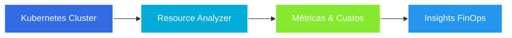
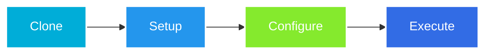

# 🚀 K8s Resource Analyzer API

[🇺🇸 English Version](README.en.md)

> API HTTP em Go para análise de recursos Kubernetes com foco em FinOps.

<div align="center">


[](https://github.com/ElizCarvalho/k8s-resource-analyzer-api/actions/workflows/ci.yml)
[](https://github.com/ElizCarvalho/k8s-resource-analyzer-api/actions/workflows/release.yml)

<p align="center">
  <a href="#-sobre">Sobre</a> •
  <a href="#-status-do-projeto">Status</a> •
  <a href="#-funcionalidades">Funcionalidades</a> •
  <a href="#-tecnologias">Tecnologias</a> •
  <a href="#-início-rápido">Início Rápido</a> •
  <a href="#-api-endpoints">API</a>
</p>

</div>

<hr>

## 📌 Sobre

<div align="center">



</div>

O K8s Resource Analyzer é uma API desenvolvida em Go que permite analisar recursos do Kubernetes com foco em FinOps. A ferramenta fornece insights valiosos sobre utilização de recursos e custos em clusters Kubernetes.

## ⚡ Status do Projeto

| Status | Funcionalidade | Descrição |
|--------|----------------|-----------|
| ✅ | **Configuração Inicial** | Estrutura base do projeto implementada |
| ✅ | **Health Check** | Endpoint de verificação de saúde da API |
| ✅ | **Documentação** | OpenAPI/Swagger implementado |
| 🚧 | **Análise de Recursos** | Coleta e análise de recursos K8s |
| 🚧 | **Integração Metrics** | Conexão com Prometheus/Mimir |
| 🚧 | **Dashboard** | Visualização de métricas e custos |

## 🛠️ Stack Tecnológica

<table>
  <tr>
    <td align="center">
      <b>Core & API</b><br/>
      <br/>
      <a href="https://go.dev/"><b>Go 1.22+ & Gin</b></a>
      <p align="center">
        • Integração nativa com client-go<br/>
        • Alta performance e baixa alocação<br/>
        • Middleware robusto e flexível<br/>
        • Execução concorrente
      </p>
      <p align="center">
        <code>Framework web de alta performance</code>
      </p>
    </td>
    <td align="center">
      <b>Observabilidade</b><br/>
      <br/>
      <a href="https://grafana.com/oss/mimir/"><b>Mimir & Zerolog</b></a>
      <p align="center">
        • Métricas históricas K8s<br/>
        • Logs estruturados em JSON<br/>
        • Rastreamento por Request ID<br/>
        • Zero alocação em logs
      </p>
      <p align="center">
        <code>Monitoramento completo e eficiente</code>
      </p>
    </td>
    <td align="center">
      <b>Qualidade</b><br/>
      <br/>
      <a href="https://golangci-lint.run/"><b>Ferramentas & Padrões</b></a>
      <p align="center">
        • Linting (golangci-lint)<br/>
        • Formatação (goimports)<br/>
        • Segurança (nancy)<br/>
        • Automação (Make)
      </p>
      <p align="center">
        <code>Garantia de qualidade de código</code>
      </p>
    </td>
  </tr>
  <tr>
    <td align="center">
      <b>Infraestrutura</b><br/>
      <br/>
      <a href="https://www.docker.com/"><b>Container & CI/CD</b></a>
      <p align="center">
        • Docker multi-stage build<br/>
        • GitHub Actions Workflows<br/>
        • Deploy automatizado<br/>
        • Isolamento seguro
      </p>
      <p align="center">
        <code>Pipeline e deploy consistentes</code>
      </p>
    </td>
    <td align="center">
      <b>Documentação</b><br/>
      <br/>
      <a href="https://swagger.io/"><b>OpenAPI/Swagger</b></a>
      <p align="center">
        • Documentação interativa<br/>
        • Schemas bem definidos<br/>
        • Exemplos práticos<br/>
        • ADRs detalhadas
      </p>
      <p align="center">
        <code>Documentação clara e atualizada</code>
      </p>
    </td>
    <td align="center">
      <b>Ambiente</b><br/>
      <br/>
      <a href="https://kubernetes.io/"><b>Kubernetes & Cloud</b></a>
      <p align="center">
        • Análise de recursos K8s<br/>
        • Métricas de custos<br/>
        • Insights FinOps<br/>
        • Otimização de recursos
      </p>
      <p align="center">
        <code>Foco em eficiência e custos</code>
      </p>
    </td>
  </tr>
</table>

> **Nota**: Cada tecnologia foi escolhida considerando as necessidades específicas de análise de recursos Kubernetes e FinOps, priorizando performance, observabilidade e manutenibilidade.

## 📦 Estrutura do Projeto

```
k8s-resource-analyzer-api/
├── cmd/                    # Binários da aplicação
│   └── api/               # Ponto de entrada da API HTTP
├── internal/              # Código privado não exportável
│   ├── api/              # Implementação dos endpoints
│   └── pkg/              # Pacotes compartilhados
├── docs/                 # Documentação OpenAPI/Swagger
├── .env.example         # Template de configuração
├── Dockerfile          # Instruções de containerização
├── Makefile           # Automação de tarefas
└── README.md         # Documentação principal
```

## 🤝 Contribuindo

1. Fork o projeto
2. Crie sua branch de feature (`git checkout -b feature/AmazingFeature`)
3. Commit suas mudanças (`git commit -m 'Add: nova funcionalidade'`)
4. Push para a branch (`git push origin feature/AmazingFeature`)
5. Abra um Pull Request

## 📝 Licença

Este projeto está sob a licença MIT. Veja o arquivo [LICENSE](LICENSE) para mais detalhes.

## 👩‍💻 Autora

Feito com ❤️ por Elizabeth Carvalho

[](https://br.linkedin.com/in/elizcarvalho)
[](https://github.com/ElizCarvalho)

## 📋 Pré-requisitos

<table>
  <tr>
    <td align="center">
      <br/>
      <b>Go 1.22+</b>
    </td>
    <td align="center">
      <br/>
      <b>Docker</b>
    </td>
    <td align="center">
      <br/>
      <b>Kubernetes</b>
    </td>
    <td align="center">
      <br/>
      <b>Prometheus</b>
    </td>
  </tr>
</table>

## 🚀 Início Rápido



1. **Clone o repositório:**
```bash
git clone https://github.com/ElizCarvalho/k8s-resource-analyzer-api.git
cd k8s-resource-analyzer-api
```

2. **Instale as dependências:**
```bash
go mod download
```

3. **Configure as variáveis de ambiente:**
```bash
cp .env.example .env
# Edite o arquivo .env com suas configurações
```

4. **Execute localmente:**
```bash
make run
```

5. **Ou com Docker:**
```bash
make docker-build
make docker-run
```

## 🔧 Configuração

### Variáveis de Ambiente

| Variável    | Descrição                   | Padrão  | Obrigatório |
|-------------|-----------------------------|---------|-------------|
| PORT        | Porta da API                | 9000    | Não         |
| GIN_MODE    | Modo do Gin (debug/release) | debug   | Não         |
| LOG_LEVEL   | Nível de log               | info    | Não         |
| LOG_FORMAT  | Formato dos logs (json/text)| json    | Não         |

## 📚 API Endpoints

### Health Check
- `GET /api/v1/ping` - Verifica o status da API
  - **Resposta de Sucesso**: `200 OK`
  - **Corpo**: `{"message": "pong", "status": "ok", "timestamp": "2024-02-18T00:00:00Z"}`

Documentação completa disponível em `/swagger/index.html`

## 🐳 Docker

### Build
```bash
docker build -t eliscarvalho/k8s-resource-analyzer-api:latest .
```

### Run
```bash
docker run -p 9000:9000 eliscarvalho/k8s-resource-analyzer-api:latest
```

### Docker Hub
```bash
docker pull eliscarvalho/k8s-resource-analyzer-api:latest
```

## 🧪 Testes

```bash
# Roda testes unitários
make test

# Roda testes com cobertura
make test-cover
```